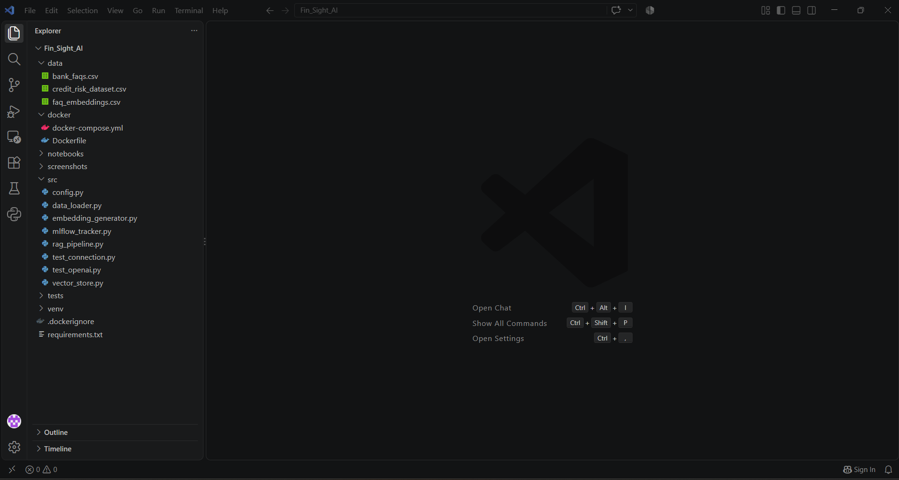
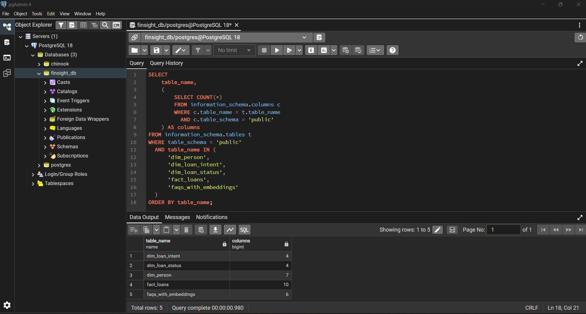
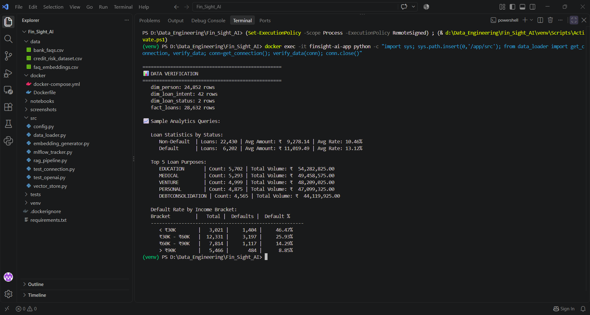
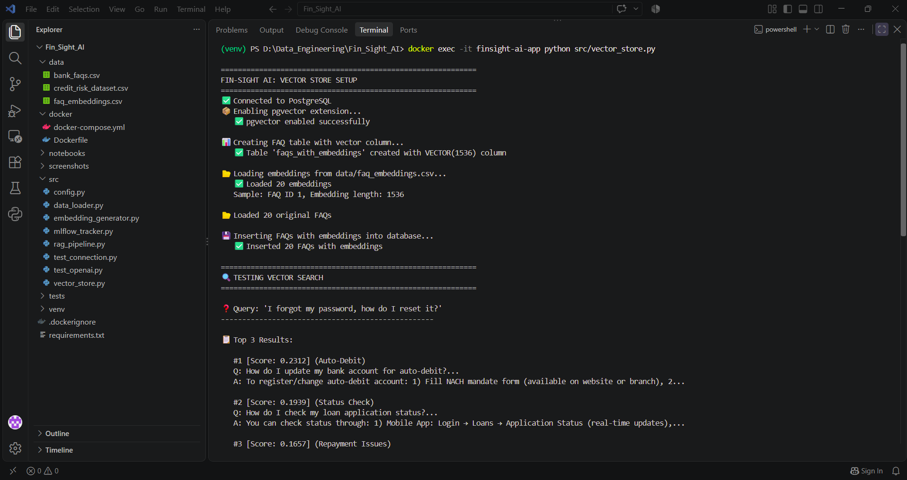
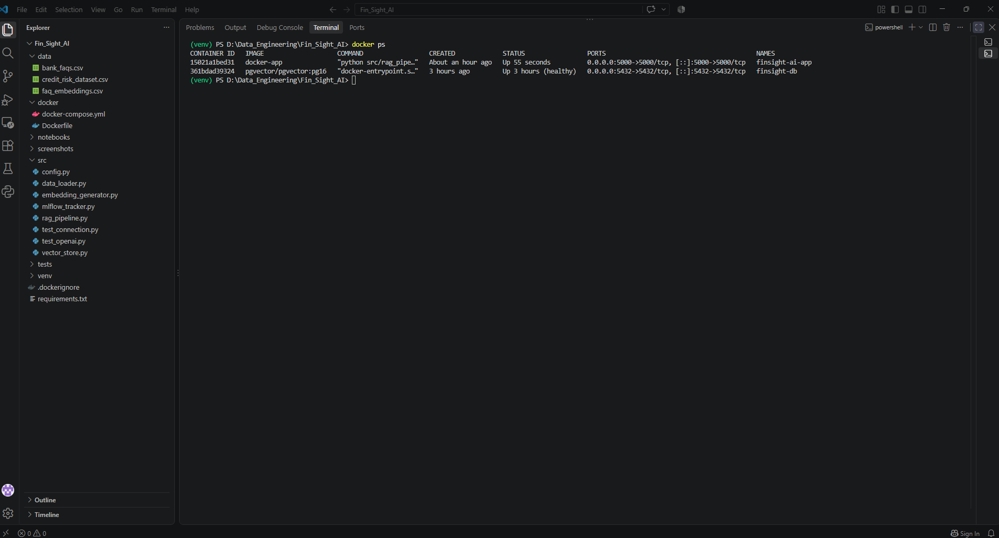
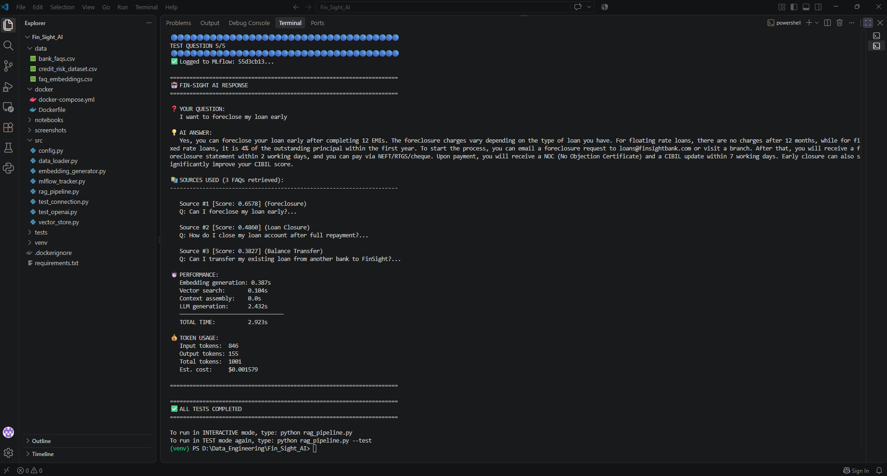

# 🏦 Fin-Sight AI: Intelligent Banking Assistant

<p align="center">
  <strong>RAG-Powered Customer Support System for Financial Services</strong>
</p>

<p align="center">
  
</p>

---

## 🎯 Project Overview

**Fin-Sight AI** is an intelligent banking assistant built using **Retrieval Augmented Generation (RAG)** architecture.

The system combines traditional Data Engineering with modern AI/ML infrastructure to answer customer questions about loans, repayments, eligibility, interest rates, foreclosure, and banking services.

Instead of relying entirely on an LLM's internal knowledge, Fin-Sight AI:

1. Converts the user's question into a vector embedding
2. Searches a PostgreSQL + pgvector knowledge base
3. Retrieves the most relevant banking FAQs
4. Builds a context-aware prompt
5. Generates a grounded answer using OpenAI
6. Logs query performance, token usage, and cost using MLflow

### The Problem It Solves

Traditional keyword-based search can fail when users phrase the same question differently.

For example:

> "I forgot my login credentials"

may not exactly match:

> "How do I reset my password?"

Fin-Sight AI uses **semantic similarity search** instead of simple keyword matching, allowing the system to retrieve conceptually related information.

---

## 🏗️ Architecture

```text
                    User Question
                          │
                          ▼
                 ┌─────────────────────┐
                 │  OpenAI Embedding   │
                 │ text-embedding-3-   │
                 │       small         │
                 └──────────┬──────────┘
                            │
                            │ 1536-dimensional vector
                            ▼
                 ┌─────────────────────┐
                 │ PostgreSQL +        │
                 │     pgvector        │
                 │                     │
                 │ Cosine Similarity   │
                 │      Search         │
                 └──────────┬──────────┘
                            │
                            │ Top-3 FAQs
                            ▼
                 ┌─────────────────────┐
                 │ Context Assembly    │
                 │                     │
                 │ Retrieved FAQs +    │
                 │ User Question       │
                 └──────────┬──────────┘
                            │
                            ▼
                 ┌─────────────────────┐
                 │     OpenAI LLM      │
                 │                     │
                 │ Grounded Response   │
                 └──────────┬──────────┘
                            │
                            ▼
                        Final Answer
                            │
                            ▼
                 ┌─────────────────────┐
                 │       MLflow        │
                 │                     │
                 │ Cost / Tokens /     │
                 │ Performance / Runs  │
                 └─────────────────────┘
```

## 🛠️ Tech Stack

| Layer | Technology | Purpose |
| :--- | :--- | :--- |
| **Programming** | Python | Application and pipeline development |
| **Data Processing** | Pandas, NumPy | Data cleaning and transformation |
| **Database** | PostgreSQL | Relational data storage |
| **Vector Database** | pgvector | Vector storage and similarity search |
| **Embeddings** | OpenAI text-embedding-3-small | Convert text into vectors |
| **LLM** | OpenAI API | Generate grounded responses |
| **RAG** | Custom Python Pipeline | Retrieval + Augmentation + Generation |
| **MLOps** | MLflow | Experiment tracking and metrics |
| **Containerization** | Docker | Application containerization |
| **Orchestration** | Docker Compose | Multi-container deployment |
| **Version Control** | Git / GitHub | Source control |
| **Environment Management** | Python venv / .env | Dependency and secret management |

---

## 📊 Dataset

### Credit Risk Dataset
The project uses a credit risk dataset containing 32,581 loan applications.
After data cleaning and validation:
**28,632 valid loan records** were loaded into PostgreSQL.

Key attributes include:
- Age
- Income
- Employment length
- Home ownership
- Loan intent
- Loan amount
- Interest rate
- Credit history
- Default status

The data is transformed into a Star Schema for analytical querying.

### Banking FAQ Knowledge Base
The RAG system uses 20 curated banking FAQs covering topics such as:

- Loan Application
- Eligibility
- Interest Rates
- EMI Calculation
- Repayment
- Late Payment Penalties
- Loan Statements
- Application Status
- Foreclosure
- Loan Closure
- Balance Transfer
- Bad Credit

Each FAQ is converted into a 1536-dimensional embedding using OpenAI's `text-embedding-3-small`. These embeddings are stored in PostgreSQL using `pgvector`.

---

## 🗂️ Project Structure

```text
Fin_Sight_AI/
│
├── data/
│   ├── bank_faqs.csv
│   ├── credit_risk_dataset.csv
│   └── faq_embeddings.csv
│
├── docker/
│   ├── Dockerfile
│   └── docker-compose.yml
│
├── notebooks/
│   └── explore_data.py
│
├── screenshots/
│   ├── 01-file-structure.png
│   ├── 02-database-schema.png
│   ├── 03-data-loaded.png
│   ├── 04-vector-search.png
│   ├── 05-rag-response.png
│   ├── 06-mlflow-dashboard.png
│   ├── 07-mlflow-runs.png
│   ├── 08-docker-running.png
│   └── 09-docker-rag-test.png
│
├── src/
│   ├── config.py
│   ├── data_loader.py
│   ├── embedding_generator.py
│   ├── mlflow_tracker.py
│   ├── rag_pipeline.py
│   ├── test_connection.py
│   ├── test_openai.py
│   └── vector_store.py
│
├── tests/
│
├── .dockerignore
├── .gitignore
├── README.md
└── requirements.txt
```

---

## 🚀 Quick Start

### Prerequisites
- Python 3.9+
- PostgreSQL
- pgvector
- OpenAI API key
- Docker Desktop
- Git

### Installation
1. Clone the repository
   ```bash
   git clone https://github.com/tarunkurapati1404/Fin_Sight_AI.git
   cd Fin_Sight_AI
   ```
2. Create virtual environment
   ```bash
   python -m venv venv
   ```
3. Activate on Windows
   ```bash
   venv\Scripts\activate
   ```
4. Install dependencies
   ```bash
   pip install -r requirements.txt
   ```

---

## ⚙️ Configuration

Create a `.env` file in the project root:

```env
OPENAI_API_KEY=your_api_key_here
```

Database configuration is handled through environment variables and `src/config.py`.  
*Never commit `.env` or API keys to GitHub.*

---

## ▶️ Running the Pipeline

### 1. Test Database Connection
```bash
python src/test_connection.py
```

### 2. Load Credit Risk Data
```bash
python src/data_loader.py
```
This performs:
```text
CSV -> Data Cleaning -> Transformation -> Star Schema
                                         ├── dim_person
                                         ├── dim_loan_intent
                                         ├── dim_loan_status
                                         └── fact_loans
```
The final cleaned dataset contains **28,632 loan records**.

### 3. Generate FAQ Embeddings
```bash
python src/embedding_generator.py
```
The process converts the 20 FAQs into 1536-dimensional vectors.

### 4. Setup Vector Database
```bash
python src/vector_store.py
```
This creates the pgvector table and loads the FAQ embeddings into PostgreSQL.

### 5. Run RAG Pipeline
- **Test Mode**
  ```bash
  python src/rag_pipeline.py --test
  ```
  Runs five predefined questions through the complete RAG pipeline.
- **Interactive Mode**
  ```bash
  python src/rag_pipeline.py
  ```
  Allows users to enter their own banking questions.

---

## 🧠 How RAG Works in Fin-Sight AI

- **Step 1 — Embedding Generation:** The user's question is converted into a numerical vector using `text-embedding-3-small` (1536 dimensions).
- **Step 2 — Semantic Search:** The vector is compared against FAQ embeddings stored in PostgreSQL using cosine similarity to retrieve the most relevant FAQs.
- **Step 3 — Context Assembly:** The top relevant FAQs are assembled into the prompt sent to the LLM.
- **Step 4 — LLM Generation:** The LLM generates the final response using the retrieved FAQ context, reducing hallucinations.

---

## 🔎 Vector Search

Unlike traditional keyword matching:
- **Keyword Search:** Exact string matching that can fail if phrasings differ.
- **Semantic Search:** Understands contextual meaning via high-dimensional vector similarity.

---

## 🗄️ Star Schema

The traditional Data Engineering portion of the project uses a Star Schema.

```text
                 dim_person
                     │
                     │
                     ▼
dim_loan_intent ── fact_loans ── dim_loan_status
```

### Tables Overview
| Table Name | Records |
| :--- | :--- |
| `dim_person` | 24,852 |
| `dim_loan_intent` | 42 |
| `dim_loan_status` | 2 |
| `fact_loans` | 28,632 |
| `faqs_with_embeddings` | 20 |

---

## 📈 Data Analytics

### Loan Statistics
| Status | Loans | Avg Amount | Avg Interest Rate |
| :--- | :--- | :--- | :--- |
| **Non-Default** | 22,430 | ₹9,278.14 | 10.46% |
| **Default** | 6,202 | ₹11,019.49 | 13.12% |

### Default Rate by Income
| Income Bracket | Default Rate |
| :--- | :--- |
| **< ₹30K** | 46.47% |
| **₹30K–₹60K** | 25.93% |
| **₹60K–₹90K** | 14.29% |
| **> ₹90K** | 8.85% |

---

## 🤖 MLflow Integration

Every RAG query is tracked using MLflow, recording parameters (user question, model, sources) and metrics (embedding generation time, vector search time, LLM generation time, token counts, cost, and total execution time).

Launch MLflow UI locally:
```bash
mlflow ui --backend-store-uri ./mlruns --port 5000
```
Then open: `http://localhost:5000`

---

## 🐳 Docker Deployment

The application runs via Docker Compose with two primary services:
```text
┌───────────────────────────────┐
│       Docker Compose          │
│                               │
│  ┌─────────────┐              │
│  │ PostgreSQL  │              │
│  │ + pgvector  │              │
│  └──────┬──────┘              │
│         │                     │
│         │                     │
│  ┌──────▼──────┐              │
│  │ Fin-Sight   │              │
│  │ AI App      │              │
│  └─────────────┘              │
│                               │
└───────────────────────────────┘
```

- **Build:** `docker compose build`
- **Start:** `docker compose up -d`
- **Check containers:** `docker ps`
- **Run test:** `docker exec -it finsight-ai-app python src/rag_pipeline.py --test`
- **Stop:** `docker compose down`

---

## 📸 Screenshots

1. **Project Structure**
<p align="center">
  
</p>

2. **Database Schema**
<p align="center">
  
</p>

3. **Data Verification**
<p align="center">
  
</p>

4. **Vector Search**
<p align="center">
  
</p>

5. **RAG Response — End-to-End**
<p align="center">
  
</p>

6. **MLflow Dashboard**
<p align="center">
  
</p>

7. **Docker Running**
<p align="center">
  
</p>

8. **Additional Project Screenshot**
<p align="center">
  
</p>

9. **Additional Project Screenshot**
<p align="center">
  
</p>

---

## 🎯 Skills Demonstrated

- **Data Engineering:** Python, Pandas, Data Cleaning, ETL, PostgreSQL, SQL, Star Schema, Data Validation, Analytical Queries
- **AI / ML Infrastructure:** OpenAI API, Text Embeddings, Vector Databases (`pgvector`), Cosine Similarity, RAG Architecture, LLM Integration, Prompt Engineering
- **MLOps:** MLflow, Experiment Tracking, Performance Metrics, Token Tracking, Cost Tracking, Artifact Logging
- **DevOps:** Docker, Docker Compose, Environment Variables, Container Networking, Health Checks, Persistent Volumes
- **Software Engineering:** Modular Python Architecture, Configuration Management, Error Handling, Logging, Testing, Git / GitHub

---

## 🔮 Future Enhancements

- Scale the FAQ knowledge base
- Add vector indexing for larger datasets
- Add Airflow orchestration
- Automatically regenerate embeddings when FAQs change
- Add conversation memory
- Add user feedback / rating system
- Add multilingual banking support
- Deploy PostgreSQL and the application to AWS
- Add automated CI/CD pipeline
- Add automated unit and integration tests
- Add monitoring and alerting

---

## 👨‍💻 About

**Tarun Kumar**  
Data Engineer | Hyderabad, India  
- 📧 Email: taruneaglewings@gmail.com  
- 💼 LinkedIn: [tarun-kumar-87b044110](https://www.linkedin.com/in/tarun-kumar-87b044110)  
- 🐙 GitHub: [tarunkurapati1404](https://github.com/tarunkurapati1404)  

This project demonstrates the combination of Data Engineering, AI/ML infrastructure, RAG, MLOps, and DevOps to build an end-to-end production-style banking assistant.

---

## 📄 License

This project is for educational and portfolio purposes.

---

## 🙏 Acknowledgments

- OpenAI for embeddings and LLM APIs
- PostgreSQL for relational data storage
- pgvector for vector similarity search
- MLflow for experiment tracking
- Kaggle for the credit risk dataset
- Docker for containerization

<p align="center">
  <strong>Built with ❤️ using Python, PostgreSQL, OpenAI, MLflow, pgvector, and Docker</strong>
</p>

<p align="center">
  <sub>Fin-Sight AI — RAG-Powered Banking Assistant</sub>
</p>